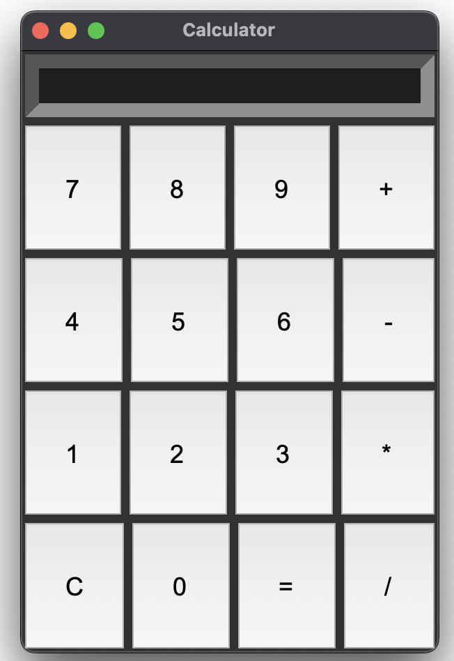

<h1> 🌟 My Calculator :- </h1>

This is a simple 🧮 Calculator created using 🐍  <b> Python </b> and <b> Tkinter </b>. It features a user-friendly graphical interface for performing <b> ➕ Addition, ➖ Subtraction, ✖️ Multiplication, and ➗ Division </b> .

<h2>✨ Features :- </h2>
<ul>
    <li>✅  Clean and easy-to-use 🖥️ design.</li>
    <li>✅ Supports basic math operations: ➕ addition (+), ➖ subtraction (-), ✖️ multiplication (*), and ➗ division (/).</li>
    <li>✅ "C" button to erase all input.</li>
    <li>✅  Fits well on all 📱 screen sizes.</li>
</ul>

<h2>📸 Screenshots :- </h2>
<h3>👀 Initial View:</h3>

    

<h3>⚡ Examples:- </h3>

    

 

Here, the user types <code>85 ➕ 10</code>, and the result is displayed when the <code>=</code> button is pressed. 

    

<h2>💻 Key Code Features :</h2>
<ul>
    <li> The 🖥️ interface is built using  Tkinter’s <code>🔘 Button</code>, <code>📝 Entry</code>, and <code>📐 Grid</code> layout tools.</li>
    <li> ⚙️ Buttons trigger actions that update the 🖥️ display.</li>
    <li>  Built-in checks make sure calculations are accurate. </li>
</ul>

<h2>📂 Steps to Run :</h2>
<ol>
    <li>📥 Download or clone this project to your 💻 computer.</li>
    <li>✅ Make sure you have  Python installed (version 3.x is best).</li>
    <li>🔧 Check if  Tkinter is included in your  Python setup.</li>
    <li>▶️ Start the program with this command:</li>
    <pre><code>🐍 python calculator.py</code></pre>
    <li>The 🧮 app will open, and you can start using it. </li>
</ol>

